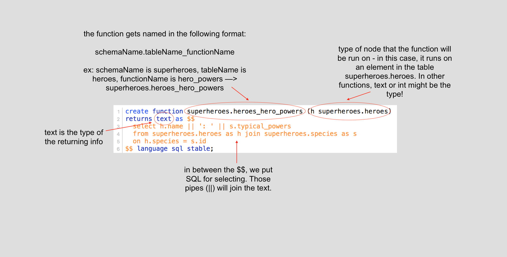

## Postgraph/Graphile
NB: this is written assuming MacOSX device.

# Getting Started

1. Make sure that you have the [Postgres App](https://postgresapp.com/) on your device, and create a DB. 

2. Recommended: install the app [Postico](https://eggerapps.at/postico/), and connect to your local Postgres DB.

3. In terminal, globally install postgraphile: 

    ```
    npm install -g postgraphile
    ```

4. Write out your Postgres SQL schema in a file.sql - make sure you save it, so that you can easily clear out and fix any mistakes to your PostgresDB. NB: you should create a schema, and then create tables attached to that schema, such as:

    ```
    create schema superheroes;
    create table superheroes.hello (
        id serial primary key,
        greeting text not null check (char_length(greeting) < 80)
    );
    comment on table superheroes.hello is 'Just a practice table to test capabilities.';
    ```

5. When your schema is all written out, add it to your DB by running each statement in Postico.

6. Now, it's time to connect to your database! It's important to remember that postgraphile expects to be pointed towards a schema, such as 'superheroes' in this example. Ex:

    ```
    postgraphile -c postgres://postgres:@localhost:5432/postgres --schema superheroes    
    ```
7. At this point, you should be connected, and postgraphile should have set it up so that you can use GraphQL to query anything from your schema! Go to [the GraphiQL interface (link also in your terminal)](http://localhost:5000/graphiql) to test it out!

8. You should be able to open the docs by clicking the top right-side button that reads "Docs". Inside, you can explore the 'Query' or 'Mutation' section to test out the GraphQL queries and mutations the postgraphile has generated for you to interface with your database. Ex:

    ```
    {
      allHellos {
        edges {
          node {
            id
            greeting
          }
        }
      }
    }
    ```

    will return:

    ```
    {
      "data": {
        "allHellos": {
          "edges": [
            {
              "node": {
                "id": 1,
                "greeting": "hello"
              }
            },
            {
              "node": {
                "id": 2,
                "greeting": "hi"
              }
            },
            {
              "node": {
                "id": 3,
                "greeting": "cheers"
              }
            }
          ]
        }
      }
    }
    ```


# Functions 
You can also create specific functions to customize your queries. For example:

I have a table (superheroes.heroes) that lists the superhero's name, their league, and references the species id from the table superheroes.species (id, species name, origin, and typical powers).

If I want to get text that describes the superhero's name and their typical powers, separated by a colon, I can make the following function:

  ```

  create function superheroes.heroes_hero_powers (h superheroes.heroes)
  returns text as $$
    select h.name || ': ' || s.typical_powers 
    from superheroes.heroes as h join superheroes.species as s 
    on h.species = s.id
  $$ language sql stable;

  comment on function superheroes.heroes_hero_powers(superheroes.heroes) is 'A superhero''s hero name and powers.';

  ```

When you create the function, give it the name in the format schemaName.tableName_functionName. In the parentheses, give it the type that it takes in, ex: int, or the node on which the function runs. My example runs on nodes of the hero table. Within the $$, goes the actual selection and joining or other manipulation of the data.



To then use this function, it is like a field on a query:

  ```

  {
    allHeroes {
      edges {
        node {
          heroPowers
          league
        }
      }
    }
  }

  ```

  will return: 

  ```

  {
    "data": {
      "allHeroes": {
        "edges": [
          {
            "node": {
              "heroPowers": "Diana of Themiscyra: Control over certain elements, immortality, flight, super strength and speed, enhanced senses and intelligence.",
              "league": "JUSTICE_LEAGUE"
            }
          },
          ...OMITTED FROM CODE SNIPPET FOR BREVITY'S SAKE...
        ]
      }
    }
  }

  ```

Another function example, taking in text:

  ```

  create function superheroes.species_powers (speciesName text) 
  returns text as $$
    select 'ORIGIN: ' || upper(superheroes.species.origin) || ' - ' || upper(superheroes.species.name) || ': ' || superheroes.species.typical_powers 
    from superheroes.species 
    where superheroes.species.name = speciesName
  $$ language sql stable;

  comment on function superheroes.species_powers (text) is 'Species and powers and origin formatted.';

  ```
This function takes in text (the name of a species in the db - in this case, valid input will be 'kryptonian', 'goddess', 'human', or 'human - mutant'), and returns a description of the species formatted.

For example:

  ```

  {
    speciesPowers(speciesname: "kryptonian")
  }

  ```
  will return:

  ```

  {
    "data": {
      "speciesPowers": "ORIGIN: KRYPTON (DESTROYED) - KRYPTONIAN: Powers of super speed and strength, flight, laser vision, x-ray vision, freeze breath, indestructible - all powers granted by yellow sun radiation."
    }
  }

  ```


